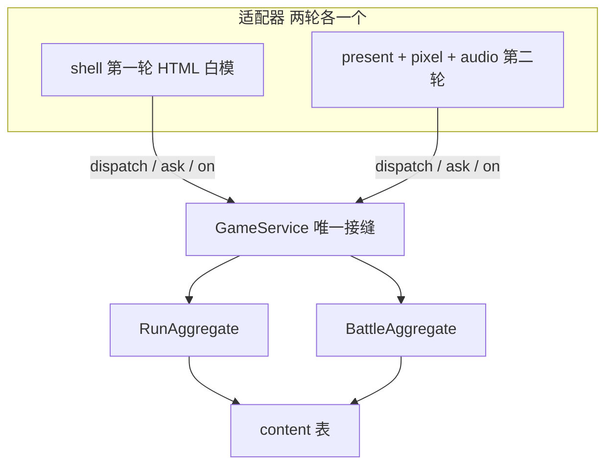
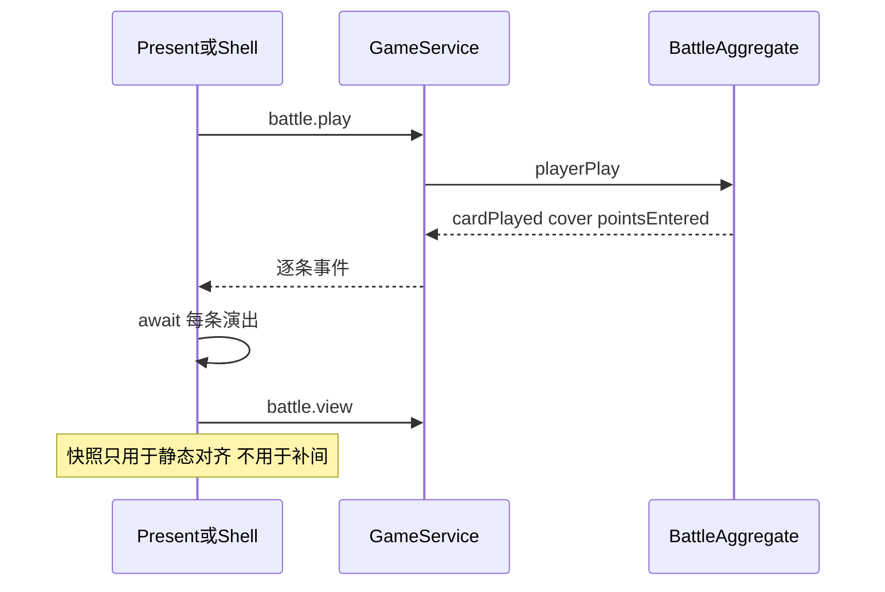

# 两轮原型：规则核 + 像素表现接缝

当前分支 [the_called4](.) 只有 Vite + React + R3F 占位立方体。规则以 [docs/索引.md](docs/索引.md) 与 [docs/0-核心设计/第四版裁定.md](docs/0-核心设计/第四版裁定.md) 为准。旧分支 `the_called3` 有完整 CQS 与像素栈，**只搬接缝形态和 `src/pixel` 引擎，不搬旧领域（敌方出牌、卡背、遗物、三层地图）**。

本原型范围锁死：一层、三场战斗、一个事件、残响 10 张 + 奖励 8 张。目标是验证化身开局、领先窗口、压迫、伤口，不是做完整肉鸽。

---

## 总架构：一个深模块，两个适配器

**GameService 是深模块**：外面只看见命令、查询、事件。覆盖、费用、领先检查、压迫顺序、伤口公式全部藏在里面。`shell` 与 `present` 是两个适配器，证明这条接缝是真的——第一轮就按第二轮要的契约写，不要事后补字段。

依赖方向：

- `present → application`，`pixel` 不知道游戏
- `application → domain + content`
- `domain` 不引用 DOM / Canvas / React
- 内容表只含 ID / 数值 / 效果目录项；显示名可整批替换，ID 不改（见 [docs/0-核心设计/虚构.md](docs/0-核心设计/虚构.md)）

第一轮卸掉 `@react-three/*` / `three` / React。入口改回 vanilla `src/main.ts`，与 `the_called3` 和 pixel-layer 一致。

---

## 接缝契约（两轮共同冻结）

表现层只做三件事：`dispatch(命令)`、`ask(查询)`、按序 `await` 每条事件做演出。读模型是**终态快照**，不能用来播动画；动画只跟事件走。演出期间锁输入，只留 `Space` 快进。

### 命令（写）

- `run.start` `{ seed? }` — 开一趟，自动编入残响 10 张，血 30
- `run.abandon`
- `run.enterNode` `{ node: 'yuZhuang' | 'drawer' | 'boShou' | 'shouMen' }` — 线性，不能跳
- `run.setDeck` `{ deck: string[] }` — 仅地图上；牌组至少 1 张，无上限
- `run.eventOption` `{ index: 0|1|2 }`
- `run.rewardPick` `{ cardId }`
- `run.finishFlow` — 战斗/事件/奖励结算完回地图
- `battle.play` `{ card: instanceId; cell?: 1-9 }` — 法术不传格，目标由引擎按卡面唯一规则解析；需要指定时加 `target?: instanceId`
- `battle.endTurn` — 化身未入场时拒绝

### 查询（读）

- `run.view` → 血、卡盒、牌组、当前节点、可进节点、屏幕（`map | battle | event | reward | over`）、种子
- `battle.view` → 见下方视图
- `battle.legalPlays` → 当前可打的 `{ card, cells[], targets[] }`；化身未入场时只返回化身
- `battle.previewPlay` `{ card, cell?, target? }` → 打完后双方最终点数、化身当前点、费用
- `battle.inspect` `{ card }` → defId、名、基础/当前点、状态
- `content.card` `{ defId }` → 卡面静态（给 tooltip / 白模）

### 事件（已发生的事实，每条带 `text` 日志行）

战斗流（演出主菜）：

- `battle.started` 遭遇 ID、开局摆阵摘要
- `battle.avatarDealt` / `battle.cardDrawn` `{ card, defId, deckLeft }`
- `battle.turnStarted` `{ turn, opening, leading, won }` — `won` 为真则本场结束；开战回合 `opening: true` 且不检查领先
- `battle.phaseChanged` `{ play | pressure | over }`
- `battle.manaChanged` `{ current, cap }`
- `battle.cardPlayed` `{ card, defId, kind: occupy|spell, cell? }`
- `battle.cardCovered` `{ victim, by, cell, victimPoints }`
- `battle.cardEntered` `{ card, cell, covered }`
- `battle.cardRemoved` `{ card, defId, cell, to: discard|exile, reason: cover|effect|banish }`
- `battle.pointsChanged` `{ card, before, after, source }`
- `battle.statusAdded` / `battle.statusRemoved` `{ card, status: 'sealed' }`
- `battle.pressureResolved` `{ cell, defId, kind }`
- `battle.leadChanged` `{ leading }`
- `battle.settled` `{ outcome: win|lose, reason: lead|avatarGone|noPlay, wound }`

一趟流：

- `run.started` / `run.hpChanged` / `run.cardBoxed` / `run.deckChanged`
- `run.battleQueued` `{ encounterId }` — GameService 在此启动 BattleAggregate
- `run.rewardOffered` `{ pool: cardId[] }` / `run.eventOffered`
- `run.screen` `{ screen }` — 路由唯一信号
- `run.ended` `{ victory | defeat }`

**冻结规则**：第二轮只许给事件**新增可选字段**，不许改名、删字段、改判定。`npm run sim` 同种子数值必须与第一轮基线逐位一致。

### 战斗视图（白模与像素共用）

需要能直接绑 UI，不必再算规则：

- 格 1–9：`card?`、是否角落、阴影地是否生效
- 每张实例：owner、zone、cell、基础/当前点、封印、是否化身
- 手牌、牌组剩余、弃牌数（敌方离场不进弃牌堆）
- 费用 current/cap、双方最终点数、是否领先、回合、阶段
- 化身：在场？当前点？预估伤口 `max(0, 10 - 当前点)`
- `mustPlaceAvatar`、`canEndTurn`

### 关键时序（引擎与演出都必须按这个拍）

玩家回合开始：**领先检查 → 封印解除 → 费用回满 → 抽 1**。开战回合跳过这四步，且不能结束回合直到化身入场。压迫按格 1→9，封印跳过；化身离场立刻判负，后面的压迫不再结算。领先检查在封印解除之前，所以封口/点名可以用来过检。

---

## 第一轮：规则、内容、白模（不碰像素）

### 领域怎么切

- [src/core](src/core)：从 `the_called3` 搬 `CommandBus` / `QueryBus` / `EventBus` / `EventStore` / `Rng` / `messages`。这些是接缝零件，不是旧玩法。
- [src/domain/geometry.ts](src/domain/geometry.ts)：九宫格、正交相邻、角落/边/中心/排/列/镜像。词条「相邻」= 正交。
- [src/domain/types.ts](src/domain/types.ts)：只留本原型枚举：`Side`、`CardKind` occupy|spell、`Zone`、`NodeId`、`EncounterId`、`CardStatus` 仅 `sealed`。
- [src/domain/battle](src/domain/battle)：点数、覆盖、费用、合法打出、压迫、领先、化身离场。不要通用效果解释器。
- [src/domain/run](src/domain/run)：线性四节点、血条、卡盒/牌组、事件三选一、两场奖励池、战后复原牌组。

点数公式按 [docs/1-概念名词/点数.md](docs/1-概念名词/点数.md)：

`当前 = max(0, 基础 + 永久 + 驻场 + 地图)`；封印的牌最终点数计 0，覆盖仍用当前点。阴影地只加在场上角落，不加手牌。覆盖入场带永久 `-(被盖牌离场前当前点)`。

费用按 [docs/2-系统机制/卡牌费用.md](docs/2-系统机制/卡牌费用.md)：未封印己方占场各 +1 上限；化身入场立刻 +1 当前；普通占场当回合只加上限。

### 效果目录（闭集，对上全部卡面）

内容表只引用这些 `do`，引擎每种实现一次。本原型卡少，比 `the_called3` 那套百卡 DSL 更深、更不容易漏。

- 入场：`buffAdjacentAllies`（灯芯）、`drawIfCovered`（倒刺）
- 被移除：`buffAvatar`（回声）
- 驻场：`reduceAvatarIncoming`（旧锁）、`avatarFloor`（锚，驱离仍离场）、`buffRowEnemies`（横梁上排）
- 法术：`damageEnemy`、`buffAvatar`、`sealEnemy`、`removeEnemiesAtMost`、`sealEnemiesAdjacentToAvatar`
- 压迫：`damageAdjacentPlayers`（重心）、`banishAvatarIfAdjacentAndAtMost`（盯人）、`damageLowestAlly`（剥手，到 0 移除）、`damageAvatarOrBanish`（守门人）

化身不能被「指定占场」类效果选中，除非效果写明化身。覆盖不能选化身。

### 内容表

[src/content](src/content) 直接编码 [docs/5-原型内容](docs/5-原型内容)：

- 残响 P01–P07、事件 EV01、奖励 R01–R08
- 遭遇：余桩 17、剥手 17、守门 22（含阴影地与驻场）
- 事件「裂开的抽屉」三选项；余桩池 / 剥手池各抽 3 看 1，已获 ID 不再出现
- [docs/4-数据汇总/数值锚点.md](docs/4-数据汇总/数值锚点.md) 单文件导出，调参先改这里

校验启动即跑：ID 唯一、引用存在、遭遇开局点数对得上锚点、牌组不能编成 0。

### 测试与白模

- 加 `vitest`。黄金用例：[docs/5-原型内容/试玩脚本.md](docs/5-原型内容/试玩脚本.md) 余桩手顺必须通。
- 再覆盖：覆盖相等不能盖、化身盖重心伤口、封印过领先检、盯人驱离、守门人 ≤3 驱离、战后伤口、普通战败扣 10 节点仍在、守门离场整趟失败、夹层只对剥手 +1 抽。
- `npm run sim`：固定种子无头走完四节点（可注入选择），打印血、回合、事件序列。第一轮结束存基线。
- [src/shell](src/shell)：可点的 HTML 白模（九宫格数字、手牌按钮、合法格高亮、费用/点数/伤口、卡盒编组、事件/奖励三选一、战斗日志）。**这是规则验收器，不是表现层。** 默认 `?present=dom`。控制台挂 `called.game`，可 `dispatch` / `ask`。

### 第一轮必须写下的交接物

给下一只做画面的 AI 用，短、可核对：

- [CONTEXT.md](CONTEXT.md)：术语表（化身、当前点数、最终点数、覆盖、压迫、领先、伤口、卡盒、牌组）。不含实现。
- [AGENTS.md](AGENTS.md)：先读索引 → 第四版裁定 → 接缝文档 → pixel-layer skill。
- [docs/6-开发交接/表现层接缝.md](docs/6-开发交接/表现层接缝.md)：上面整份命令/查询/事件/视图、场景路由表、资产 ID 对照、每条事件建议演出、禁止事项。
- 读模型类型导出在 `src/application/readmodels/*`，表现层只 import 这些类型和 `GameCommand` / `GameQuery`。

第一轮完成标准：白模能从残响打到守门通关或失败；`sim` 基线稳定；接缝文档与代码类型一致。

---

## 第二轮：像素表现、动态对象、juicy、基础音效

按 [pixel-layer](.cursor/skills/pixel-layer/SKILL.md) 落地顺序做，**有玩法再做场景壳**（第一步已由第一轮满足）。

### 引擎

从 `the_called3` 的 `src/pixel/**` 搬 Stage / palette / dsl / shapes / lint / text / input / tween / light / sky / scenery / terrain / ui / assets / editor。不搬 `sprites/chars` 旧角色、旧卡图、旧场面。`pixels.html` 仅 development；`npm run sprites:lint` 进 build。

### 场景（`src/present`）

比旧版瘦：没有 Daily 横版过场义务，但可以做一张短桌面建立「坐下」的感觉。

- `TitleScene` — 开一趟
- `MapScene` — 四个线性节点 + 常驻「阴影地」+ 血条 + 打开卡盒
- `EventScene` / 奖励面板 — 三选一
- `BattleScene` — 俯视桌面 + 九宫格（主场）
- `DeckEditor` overlay
- `EndingScene`

`PresentApp` 照搬事件队列：`enqueue → pump → scene.handle` 可 await。`run.screen` / `run.battleQueued` / `battle.started` 负责路由。`?present=dom` 保留一个版本周期。

### 动态对象与 juicy（本轮要够有趣的部分）

战场不是静态贴图，而是一桌会动的东西：

- **化身**：ASCII 角色，idle 呼吸、落地 squash、受伤闪、被驱离碎裂。伤口预估始终可见（试玩脚本点名：不能只藏在结算里）。
- **敌方占场**：形状图标当「桌上器物」。压迫结算时按格号依次前倾/砸桌；盯人锁定相邻格；守门人每回合啄化身。
- **玩家占场**：入场从手牌飞入、覆盖压扁被盖者并弹出 `-N`、灯芯入场相邻跳 `+1`。
- **法术**：余温/抽薪削点飘字；封口/点名上锁链；清场低点敌方碎裂。
- **桌面反馈**：领先边光、费用水晶涨格、压迫阶段整桌微震、化身掉点滴血到顶栏。
- **地图**：节点器物轻晃；阴影地四角一圈暗；血条伤口而不是抽象数字条。

补间预算：单段 ≤ 0.4s，同类连续事件合并；`Space` 提高 `tween.speed`。每帧 `drawImage` ≤ 200。

资产 ID 前缀跟内容对齐：`char.avatar`、`npc.e1a`…、`card.p01`…、`icon.mana` / `icon.seal` / `icon.lead`、`fx.cover` / `fx.pressure`、`prop.desk`、`ui.panel`。缺图 `?` + warn，不抛错。

### 音效

`src/audio/audio.ts`：Web Audio 短采样或合成器即可，不要做编曲。

一拍一音：出牌、覆盖、抽牌、费用、压迫砸下、化身受伤、驱离、领先、胜利、失败、点击、选奖励。全局静音；演出快进时音效也缩短或跳过。

---

## 明确不做

- 敌方手牌 / 出牌 AI / 格子填满比大小 / 卡牌移动换位
- 精神负荷、卡背、信仰、献祭、遗物、商店、三层大地图
- 在 WebGL / R3F 里复刻像素管线
- 第一轮画精灵、第二轮改判定
- 锁定世界观长文案（卡名保持器物名即可）

---

## 建议会话切法

第一轮大约 4 个会话：接缝+几何+内容表 → 战斗引擎+测试 → 一趟流程+白模 → 交接文档与 `sim` 基线。

第二轮大约 5 个会话：搬像素引擎 → 地图/事件白盒像素化 → 牌局静态+输入 → 全事件 juicy → 音效与三场气氛。

两轮之间的唯一交接面就是 **GameService + 接缝文档**。表现 AI 的第一句话应当是：打开白模打完余桩，再对照 `docs/6-开发交接/表现层接缝.md` 把每条 `battle.`* 接上演出。