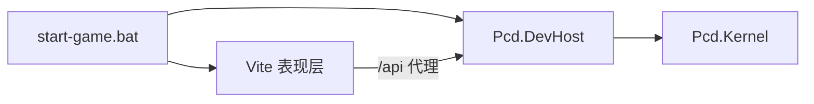

# 用 The-Called 表现层接上 P_CD 内核

这份计划已经过时。内核和内容目录已经迁进本仓库，不再从旁边的 P_CD 启动。当前分界见 `docs/adr/0012-one-repo-kernel-content-web.md`。

内核留在 [P_CD](C:\Users\jinji\Documents\GitHub\P_CD)，不复制进本仓库，也不改写成 TypeScript。网页只消费 DevHost 已有的 `GET /api/catalog`、`POST /api/start`、`POST /api/answer`。合法操作只来自返回的 `pending.options`；胜负、抽牌、意图、污染格、点数都信 `view` 和本步 `events` / `steps`。局外的地图和牌组按 [ADR-0005](C:\Users\jinji\Documents\GitHub\P_CD\docs\adr\0005-meta-game-outside-kernel.md) 留在网页里，进战斗时只提交 `MatchSetup`。

三个可挑战对象以内容表为准：`monster.001` 失控机械、`monster.002` 活数据库、`monster.003` 废燃泰坦。




表现层继续用现有 [GameCanvas](C:\Users\jinji\Documents\GitHub\The-Called\src\scene\GameCanvas.tsx)、[Board](C:\Users\jinji\Documents\GitHub\The-Called\src\scene\board\Board.tsx)、[Card3D](C:\Users\jinji\Documents\GitHub\The-Called\src\scene\cards\Card3D.tsx)。卡面沿用现在的几何牌框，把目录里的牌名、点数、效果文本画上去。旧的 v6 牌效脚本不再参与结算。

## 第一次：三场对局能打

目标：一键拉起内核和网页，从主菜单选一只怪物和一套预设牌组，在现有棋盘上打完一整局。

启动改 [start-game.bat](C:\Users\jinji\Documents\GitHub\The-Called\start-game.bat)：

- 内核目录默认是同级 `..\P_CD`，可用环境变量 `PCD_ROOT` 覆盖；找不到就停并说明。
- 先起 `dotnet run --project src\Pcd.DevHost`，从 5180 起找空端口；再起 Vite，从 4174 起找空端口。
- Vite 把 `/api` 代理到该 DevHost。浏览器只跟 Vite 说话，DevHost 不用为跨域改代码。
- 关掉窗口时停掉这次拉起的 DevHost。

网页侧新增一层薄客户端（建议 `src/pcd/`）：请求类型对齐 [Program.cs](C:\Users\jinji\Documents\GitHub\P_CD\src\Pcd.DevHost\Program.cs) 的 `view`、`pending`、`result`、`snapshot`、`steps`。对局状态以服务端 `snapshot` 续局，不在本地重放规则。

把 [BattleScreen](C:\Users\jinji\Documents\GitHub\The-Called\src\game\v6\view\battle\BattleScreen.tsx) 的驱动从 `Encounter` / `playEncounterCard` 换成这层客户端：

- 用 `view.cells`、`view.hand`、牌库与弃牌张数、`revealedIntent`、`pools` 投影成现有 `gameStore.match` 和意图预告。格位仍是 1–9 对 `cell-row-col`，沿用 [project.ts](C:\Users\jinji\Documents\GitHub\The-Called\src\game\v6\view\battle\project.ts) 里的坐标换算。
- 点击手牌和格子时，只在 `pending.options` 里找对应的 `option.id` 再 `POST /api/answer`。结束回合、选目标、确认法术同样只提交已有选项。内核没给出的操作，界面上不可点。
- 演出按 `steps` 里的事件走：`intent-revealed`、`card-played`、`card-entered`、`points-changed`、`card-removed`、`card-drawn`。污染格读 `view.cells[].polluted`。不再把这些事件翻译回 v6 的 `EffectCue`。
- 信仰等资源池在战斗界面上用短读数显示。主菜单里的规则说明改成跟内核对齐的说法：怪物靠意图出牌，满格与资源结算以 [流程与元游戏](C:\Users\jinji\Documents\GitHub\P_CD\docs\game design\01-流程与元游戏.md) 为准。

这一次的入口可以很窄：主菜单「开始游戏」进入三怪选择，牌组只用目录里的 `deck.science` / `deck.mystery` / `deck.religion`。打完回选择页。旧的 21 节点地图先不要再接到这场战斗上。

验收：`dotnet test` 在 P_CD 仍通过（这次不改内核）。本仓库用一份录好的 `view`/`options` JSON 测投影和选项匹配。浏览器里从启动脚本进一局，打出一张牌、看意图、结束回合、分出胜负。

## 第二次：三分叉地图、卡背、拆掉旧规则

地图改成固定的四节点，不再用 [generateMap.ts](C:\Users\jinji\Documents\GitHub\The-Called\src\game\v6\map\generateMap.ts) 的程序化图。起点一条边连出去，分成三个战斗节点，分别是上述三只怪物。三路从开局都可走，可重复挑战。走路动画和地点标记继续用 [MapView.tsx](C:\Users\jinji\Documents\GitHub\The-Called\src\game\v6\view\map\MapView.tsx) 和 [marks.tsx](C:\Users\jinji\Documents\GitHub\The-Called\src\game\v6\view\map\marks.tsx)，布局改成固定分叉，去掉迷雾、商店、Boss 门槛和层数环。

构筑改读 `/api/catalog`。牌组 15 张，负荷和同名上限交给内核判断，网页不自己复写一套上限。DevHost 增加一个只调用现成 `DeckRules.Validate` 的校验接口，构筑界面用它提示。牌组存在本机。

卡背是这次唯一需要动内核的地方。规则、视图和 `DeckRules` 已经认卡背，[CreateFresh](C:\Users\jinji\Documents\GitHub\P_CD\src\Pcd.Kernel\Runtime\Match\MatchState.cs) 建局时却只调用不带卡背的 `CreateDefined`：

```511:517:C:\Users\jinji\Documents\GitHub\P_CD\src\Pcd.Kernel\Runtime\Match\MatchState.cs
            for (int i = 0; i < setup.BuildDeck.Length; i++)
            {
                state.BuildDeck.Add(setup.BuildDeck[i]);
                CardInstance card = CreateDefined(catalog, state, setup.BuildDeck[i], Side.Player);
                card.Zone = Zone.MatchDeck;
                state.Player.MatchDeck.Add(card);
            }
```

补上与 `BuildDeck` 等长的可选 `BuildBacks`：`MatchSetup`、快照、录像、`/api/start` 都带上；缺省或空串视为白板。建牌时走已经存在的 `BackPoints` / `BackAbilities`。旧快照没有该字段时仍能读。网页构筑给每张牌配一个卡背，牌背沿用现在的几何背面，写上卡背名。不另做商店和金币购买；卡背从目录里选用，受负荷和 `cap` 约束。

删掉不再上场的本地权威和多余流程：`src/game/v6/rules`、`turn`、`encounter`、`scripts`、`enemy`，程序化地图与商店、金币、战后抽卡奖励，以及 [LevelPage](C:\Users\jinji\Documents\GitHub\The-Called\src\pages\LevelPage.tsx) 这条旧关卡链（`matchEngine`、`game/ai`、旧卡牌效果表）。主菜单只留：地图、构筑、设置。启动脚本保持第一次的双进程形态。

验收：三分叉能分别进入三场内核战；带卡背的 15 张牌组能通过校验并改变局内点数或能力；非法牌组被内核拒绝。P_CD 补一条开局卡背测试。浏览器里走完「起点 → 一支 → 战斗 → 回地图 → 构筑改卡背 → 再战」。