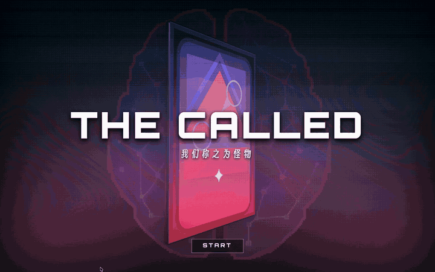
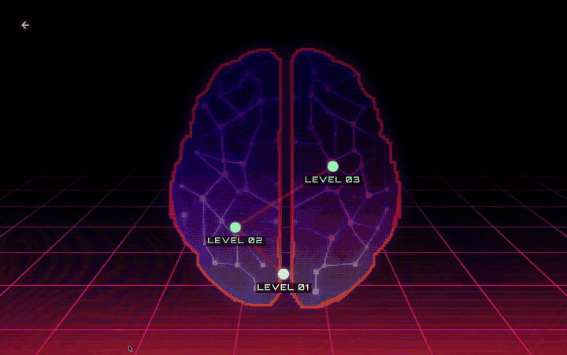
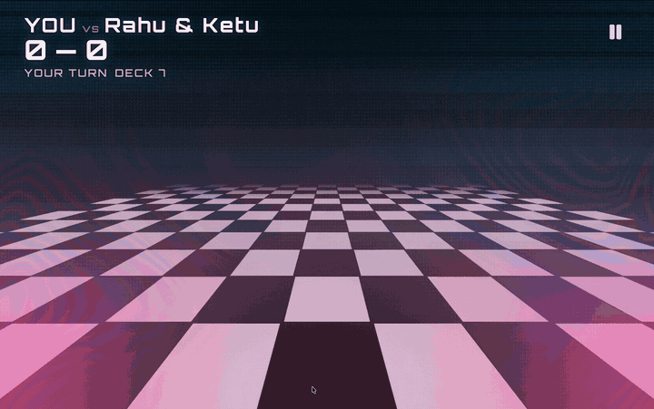
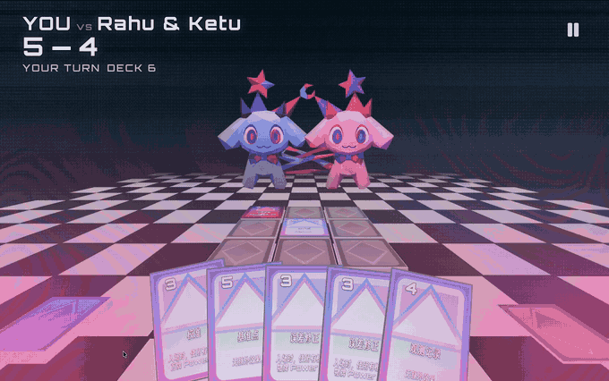
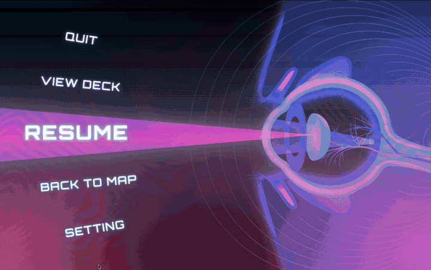

# 《我们称之为怪物 The Called》

> **怪物并不存在，直到我们这样称呼它。**

 

 

### 在怪物被发现以前，它只是一种现象。

天空暗了下来。月亮消失。阴影吞没太阳。

人类观察它，畏惧它，试图理解它。\
当理解失败，我们便给它名字、意图、性格与罪责。

于是，现象拥有了面孔。\
传说拥有了身体。\
怪物由此诞生。

 

《我们称之为怪物 The Called》是一款视觉驱动的空间策略卡牌游戏。你将在意识深处穿行，面对由日食、月影与古老叙事塑成的巨型存在。使用观测、校准与反证争夺棋盘，在有限空间中建立自己的解释体系。

但请记住：你所看见的形状，未必属于它。

也可能属于你。

 

## 穿行于意识的暗面

每一次深入，都是一次对未知的重新命名。沿着意识地图选择你的路径，在逐渐合拢的阴影中寻找线索、风险与下一场遭遇。没有一条道路绝对安全——只有尚未被证伪的解释。

 

## 在有限空间中建立你的解释

观察场域，校准位置，然后落下你的判断。每一张卡牌都在改变棋盘上的关系；每一个格位，都可能成为理解巨物的支点。战斗开始之前，你如何描述眼前之物，已经决定了它将如何回应你。

 

## 与被命名之物正面交锋

运用观测、校准与反证争夺棋盘，在层层展开的视觉异象中瓦解对手的叙事。你面对的不只是一个敌人，而是一套正在成形的解释——打破它，或者被它吞没。

 

## 暂停，但不要移开视线

在意识再次下潜之前，短暂回望你所经历的一切。怪物不会因为时间停止而消失；它只是静静等待，等待你再次赋予它轮廓。
