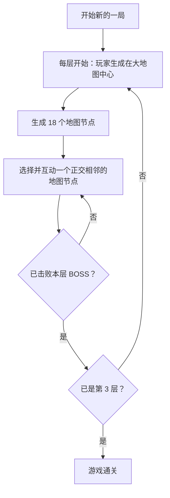

<title>循环</title>

# 局内循环

```mermaid
flowchart TD
    A[开始新的一局] --> B[每层开始：玩家生成在大地图中心]
    B --> C[生成 18 个地图节点]
    C --> D[选择并互动一个正交相邻的地图节点]
    D --> E{已击败本层 BOSS？}
    E -->|否| D
    E -->|是| F{已是第 3 层？}
    F -->|否| B
    F -->|是| G[游戏通关]
```

每层的节点构成与生成规则详见[[层级循环]]。

# 局外循环

待设计。方向已定：**解锁**（通关后解锁新体系、新化身、新卡池）与**进阶难度**（每通关一次解锁一级、逐级加难）两者都做。

[[遗物]]与金币**不跨局**，与[[卡盒]]一样每局结束后清空。