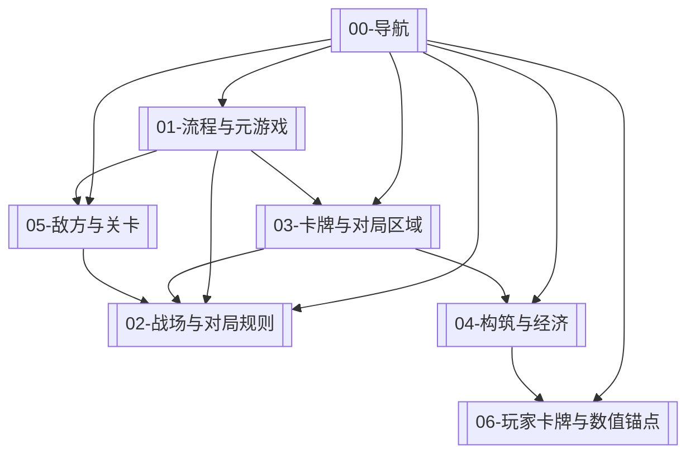

# The Call · 第四版 · 规则文档导航

第四版规则已按 **6 份主题文档** 聚拢；

> [!tip] 建议阅读顺序
> [[01-流程与元游戏]] → [[02-战场与对局规则]] → [[03-卡牌与对局区域]] → [[04-构筑与经济]] → [[05-敌方与关卡]] → [[06-玩家卡牌与数值锚点]]（查表 / 定价时再看）。

## 主题文档一览

| 文档 | 涵盖内容 |
| :--- | :--- |
| [[01-流程与元游戏]] | 玩法、循环、大地图、关卡内循环、回合流程、强制结算 |
| [[02-战场与对局规则]] | 九宫格战场、点数、覆盖、词条 |
| [[03-卡牌与对局区域]] | 卡牌、手牌、局内牌组、弃牌堆 |
| [[04-构筑与经济]] | 卡盒、牌组构筑、负荷、卡背、经济、初始牌组表 |
| [[05-敌方与关卡]] | 敌方意图、怪物技能、怪物数据、敌方侧卡牌 |
| [[06-玩家卡牌与数值锚点]] | 玩家侧卡表（三体系 + 中立）、数值锚点 / 负荷公式 |

## 结构关系

## 流程嵌套（速查）

- **宏观**：[[01-流程与元游戏#大地图]] → [[01-流程与元游戏#关卡内循环]] → 回大地图（见 [[01-流程与元游戏#循环]]）
- **微观**：[[01-流程与元游戏#回合流程]] 循环直至 [[01-流程与元游戏#玩法]] 分出胜负
- **胜负**：以 [[01-流程与元游戏#玩法]] 为准。先比 [[02-战场与对局规则#点数|总点数]]；只有该节写明的平点场合才再比占格
- **构筑**：[[04-构筑与经济#卡盒]] → [[04-构筑与经济#牌组]]（15 张 / 90 负荷）+ [[04-构筑与经济#卡背]]
- **内容**：[[05-敌方与关卡#怪物数据]] 驱动关卡；卡表在 [[06-玩家卡牌与数值锚点#玩家侧卡牌]]

---

