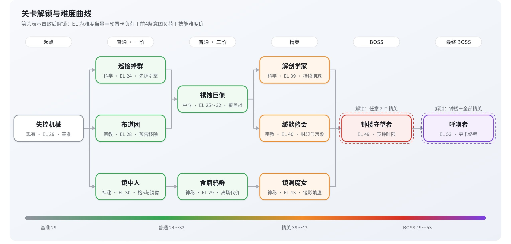

<title>关卡流程</title>

# 关卡具体流程

| 顺序 | 规则层描述 |
|-|-|
| 1.**关卡开始** | 关卡开始，记录当前牌组初始状态 |
| 2.**怪物生成** | 确定本关卡出场的怪物，按照怪物数据在九宫格战场上摆放敌方侧卡牌 |
| 3.**首回合开始** | 玩家先手，随后双方按回合流程进行，详见回合流程 |
| 4.**胜负结算** | 回合流程中触发强制结算条件，详见强制结算流程 |
| 5.**卡组复原** | 将牌组复原到初始状态 |
| 6.**奖励环节** | 战斗胜利后，获得可自行决定是否加入牌组的卡牌，不加入自动归入牌库，超限的自动售出 |
| 7.**战后去向** | 胜利后返回大地图，可自由选择已解锁的关卡重复挑战；战败则不获得奖励，直接返回大地图 |

# 关卡曲线

| 怪物 | 定位 | 体系倾向 | 预置 | 意图数 | 技能 | EL | 考点 |
|-|-|-|-|-|-|-|-|
| 失控机械（现有） | 普通 · 入门 | 科学 | 1 | 3 | 无 | 29 | 解析标记入门，作为基准 |
| 巡检蜂群 | 普通 · 一阶 | 科学 | 1 | 3 | 无 | 24 | 先拆引擎，看住填盘节奏 |
| 布道团 | 普通 · 一阶 | 宗教 | 1 | 3 | 无 | 28 | 敌方信仰，预告好的移除 |
| 镜中人 | 普通 · 一阶 | 神秘 | 1 | 3 | 无 | 30 | 镜像格，格5没有镜像 |
| 锈蚀巨像 | 普通 · 二阶 | 中立 | 0 | 3 | 无 | 25～32 | 覆盖战，看意图决定出牌大小 |
| 食腐鸦群 | 普通 · 二阶 | 神秘 | 1 | 3 | 无 | 29 | 覆盖与击杀的代价 |
| 解剖学家 | 精英 | 科学 | 1 | 4 | 活体解析 | 39 | 每回合生效的削减引擎 |
| 缄默修会 | 精英 | 宗教 | 1 | 3 | 干扰 | 40 | 封印、移除与污染格 |
| 镜渊魔女 | 精英 | 神秘 | 2 | 3 | 镜像反射 | 43 | 双倍速填盘与站位 |
| 钟楼守望者 | BOSS | 宗教×科学 | 2 | 3 | 封锁 | 49 | 丧钟时限，两层拆解 |
| 呼唤者 | 最终 BOSS | 三体系 | 1 | 4 | 呼唤、呓语 | 53 | 夺卡，综合检验 |

解锁关系：击败失控机械，同时解锁三条体系线的入口；锈蚀巨像由巡检蜂群或布道团解锁，是科学线与宗教线的交汇点；击败任意 2 个精英解锁钟楼守望者，击败钟楼守望者与全部 3 个精英后解锁呼唤者。每条线都能用对应体系的初始牌组推进，而每只怪物的奖励又会把玩家引向另一套体系的卡。